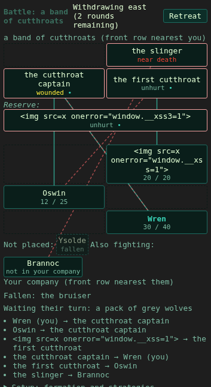

# Phase 30f verification

Implementation branch: `phase-30f-battlefield`, based on master `f79995a5`.
The owner approved the design defaults on 2026-10-02. The phase is unmerged;
independent review by **Opus 5.5** is pending.

## Delivered behavior

- Travel ambushes and camp raids use the best present, living observer,
  effective light, enemy stealth, and room concealment. The encounter's
  result is consumed once at battle entry. Failed, ordinary, and exceptional
  detection suppress the appropriate side for exactly one combat round.
  Existing Watch and tracker benefits remain. World time does not advance.
- Shower of Sparks captures a primary target and recomputes its living,
  visible orthogonal cluster at completion. Hidden or fallen primary targets
  do not redirect the spell. Both company and enemy casters use this rule.
- Opt-in leaps pass a broken front column, while standing protectors still
  block them. Open adjacent front columns expose rear fighters to melee.
  Sweeps spend one action on one normal strike per eligible front-row target;
  guardians and ordinary defenses still apply. Both capabilities have a
  three-combat-round cooldown and suppress extra weapon strikes.
- Narrow rooms project both formations into two active columns. Overflow
  occupies a marked reserve with ranged/spell access, and moves into
  vacancies as members fall. Saved formation remains unchanged. Private
  GMCP, reach, targeting, guards, and the browser use the same projection.
- Authoritative remaining Fatigue reduces physical hit chance by 5, 10,
  or 20 percentage points at 50, 25, or 0; absent needs are neutral. Existing
  cold buffs at Frostbitten or worse add one round to each new chant or
  sling load, with one warning per action. Other shooting weapons are exempt.
- A failed travel-interruption save cancels the newly spawned encounter
  group before retry. Existing recovery and raid firing retain their owners.
- Shipped examples: timber wolf leap, forest ogre sweep, and narrow,
  concealed ground at the ruined Forest bridge. New indexed battlefield
  and ambush help, updated related help, and a Combat tutorial pointer ship
  with the mechanics.

## Tests and focused scenarios

Pure tests cover detection caps/margins, light and concealment, Fatigue
boundaries, orthogonal clusters, open flanks, nine-member folding, reserve
restrictions, and recovery into vacancies.

Real `DoCombat` integration tests exercise all three opening outcomes,
second-round resumption, chant/ability suppression, separate player battles,
Watch consumption, player and enemy Sparks clusters, hidden primary targets,
downed versus standing leap protection, disabled protectors, sweep guard
interception and cooldown, unchanged saved formation, private GMCP cells,
and cold chant/sling wait ticks and narration. Travel tests exercise failed
save rollback, retry, and removal of the complete spawned group.

The focused balance checks assert one sweep strike per front-row opponent,
one company or enemy opening round only, and a reduced physical hit rate
over 3,000 rested versus 3,000 collapsed attacks. Existing balance goldens
are unchanged; the opt-in full balance matrix was not rerun.

The Chromium/Playwright dock suite passes all 219 checks, including two visible active
columns, marked enemy reserves, effective company cells, saved Setup cells,
and the existing keyboard, narrow-viewport, and HTML-escaping checks.
The screenshot below uses the acceptance harness; HTML-looking names are
intentional escaped-input fixtures.

## Required checks

- `make generate`: passed.
- `make validate`: passed.
- `make js-lint JSHINT=/workspace/ashveil-env/js/node_modules/.bin/jshint`: passed.
- `make lua-lint`: passed, zero warnings/errors.
- `go test -race ./...`: passed after fixture cleanup.
- `git diff --check`: passed.

The first full race run caught a narrow-room tag leaking from a test into
later formation/guardian fixtures. Fixture cleanup now restores the original
tags; the affected tests pass together with all new battlefield tests.

No independent review has happened in this implementation session. The
requested Opus 5.5 review and the repository's pre-merge review gate remain
outstanding. No merge or auto-merge is authorized by this delivery.
